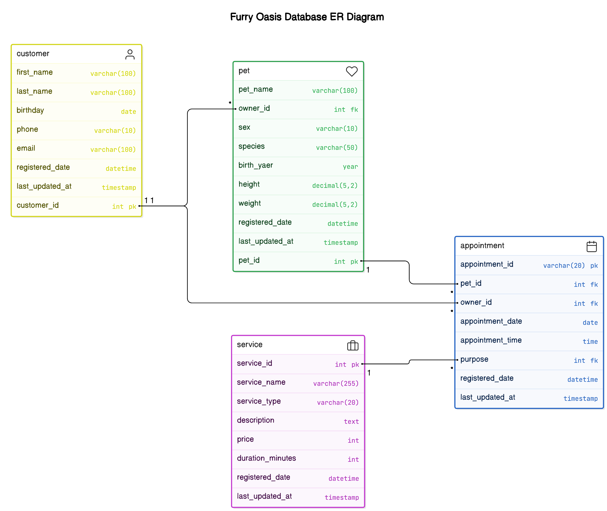

# DatabaseSystem
> 2024 Fall Semester
>
> Course：Database System
> 
> Lecturer：Prof. CAI,Yun-Cheng
> 
> Name：Chang, Huai-Tzu
> 
> Markdown document：https://markdown.tw/

 # Video Presentations for Homework #

 **HW1** :
[What's Your Zodiac Sign](https://youtu.be/qHA9-f-NW98) / [Code](https://github.com/marcelinechang/DatabaseSystem/tree/main/HW1_ZodiacSign)   
* Used Flask and MySQL to build a web application and database  
* Implemented Create, Read, Update, and Delete (CRUD) functionality

**HW2** : [A Mock Database for a Pet Care Center - Furry Oasis](https://youtu.be/v_XagPPHcP4) / [Code](https://github.com/marcelinechang/DatabaseSystem/tree/main/HW2_PetCareCenter-FurryOasis)  / [Database ER Diagarm](https://app.eraser.io/workspace/V90JlxaSMDJYiLstcw9Z?origin=share&elements=Qjr-M0vQJZT9-Wzr4UENtg)  

* **Upcoming Appointments Section**:
   * Displays a list of scheduled appointments over the next 7 days, including today.
   * Includes relevant details such as appointment date, time, and pet information.
* **Appointment CRUD Features Features**:
   * Options to make new appointments for both existing and new pets.
   * Interactive forms include fields for pet and owner details, type of service (grooming, boarding, medical), and appointment scheduling preferences.
* **Filtering Options**:
   * Allows filtering of appointments by species and type of service.
 

**HW3** : [Tell Me About U](https://youtu.be/y3Db4-Dd6WQ) / 

 # Notes #

## How to Install MongoDB on a MacBook Pro with M3 Chips ##

1. **Download and Install MongoDB Compass (GUI) for Apple Silicon:**
   - Visit: [MongoDB Compass Download](https://www.mongodb.com/try/download/compass)
   - The version I used is MacOS arm64 (M1) (11.0+) 1.44.5 (Stable).
   - Reference: [How to Install MongoDB Compass on Mac | Install MongoDB Compass on macOS (2024)](https://youtu.be/sSoVyHap3HY?si=WS7P00NhEJW1M2Ez)

2. **Download the MongoDB Community Server for Apple Silicon:**
   - Visit: [MongoDB Community Server Download](https://www.mongodb.com/try/download/community)
   - The version I used is MacOS arm64 8.0.1.
   - Reference: [MongoDB Installation on MacBook Pro with Apple Silicon Chip (M3)](https://medium.com/@meetwithIT/mongodb-installation-on-macbook-pro-with-apple-silicon-chip-m3-f1fea73da739)
    
3. **Creating a New Connection in MongoDB Compass**

## Free ER Diagram Tool ##

* [draw.io](https://www.drawio.com/)
* [lucidchart](https://www.lucidchart.com/pages/)
* [DiagramGPT](https://www.eraser.io/diagramgpt)
